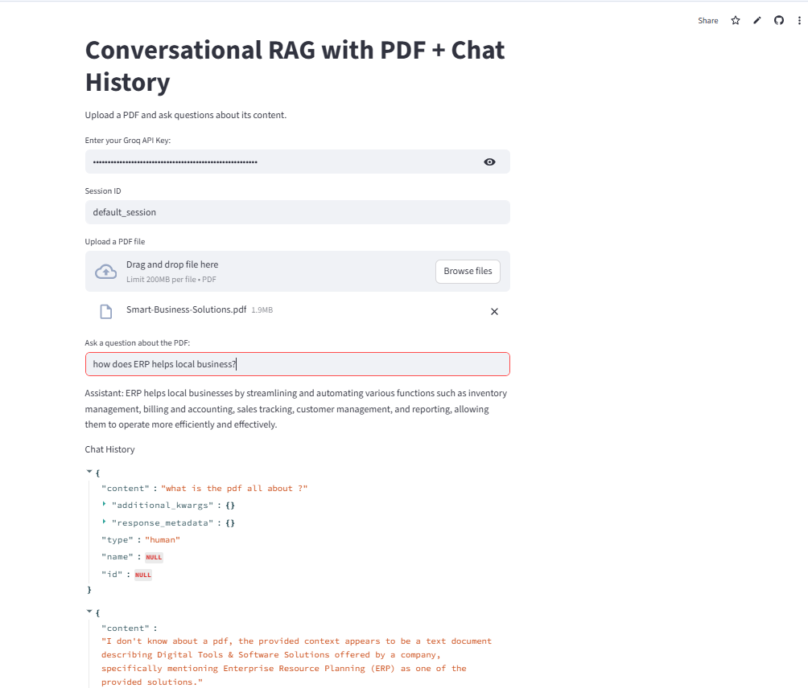

# 📄 SmartDoc AI: Conversational Knowledge Base for PDF Analysis

**SmartDoc AI** is a Retrieval-Augmented Generation (RAG) platform that transforms static PDF documents into an interactive conversational knowledge base. By using **history-aware retrieval**, the system understands the context of multi-turn conversations, making follow-up questions feel natural and allowing deeper exploration of document content.

🚀 **[View Live Demo](https://smartdoc-ai-conversational-knowledge-base-for-pdf-analysis-9t4.streamlit.app/)**

---

## 🖼️ Preview



> Make sure your screenshot file (`photo.png`) is uploaded to the root of your GitHub repository.  
> If the file is inside another folder like `assets`, update the path accordingly:
> ``

---

## 🌟 Key Features

- **Multi-Turn Conversations**: Maintains chat history so users can ask follow-up questions naturally, including references like “that” or “the previous section.”
- **History-Aware Retrieval**: Rewrites user queries into standalone questions before retrieval, improving context understanding.
- **Intelligent Document Chunking**: Uses `RecursiveCharacterTextSplitter` to preserve semantic meaning across document chunks.
- **Fast Vector Search**: Powered by **ChromaDB** and **HuggingFace embeddings** for efficient retrieval of relevant content.
- **Low-Latency Responses**: Uses **Groq with Llama-3.1-8b-instant** for fast and reliable inference.
- **Session-Based Chat Handling**: Keeps user conversations isolated using `session_id` and `st.session_state`.

---

## 🛠️ Tech Stack

- **LLM Engine**: Llama-3.1-8b-instant (via Groq)
- **Orchestration**: LangChain
- **Vector Database**: ChromaDB
- **Embeddings**: HuggingFace `all-MiniLM-L6-v2`
- **Frontend**: Streamlit
- **Document Processing**: PyPDF
- **Environment Management**: Python-Dotenv

---

## 🚀 Getting Started

### 1. Clone the Repository

```bash
git clone https://github.com/djain28006/smartdoc-ai.git
cd smartdoc-ai


## 2.Install Dependencies

```bash
pip install -r requirements.txt

### 3.Set Up Environment Variables

Create a .env file in the project root and add your Groq API key:

```bash
GROQ_API_KEY=your_groq_api_key

### 4.Run the Application

```bash
streamlit run app.py

🧠 Technical Architecture

The application follows a three-stage RAG workflow:

Contextualization
A history-aware retriever takes the latest user query along with previous chat messages and converts it into a standalone question.

Retrieval
The standalone query is searched against the ChromaDB vector store to fetch the most relevant document chunks.

Response Generation
The retrieved chunks are passed into the final prompt along with chat context so the LLM can generate an accurate, grounded answer.

📂 Use Case

This project is useful for:

Conversational document search

Research paper exploration

PDF-based Q&A systems

Internal knowledge base assistants

Multi-document analysis workflows


👤 Author

Danish Jain

Aspiring Python Developer | Machine Learning Enthusiast

💼 LinkedIn: Danish Jain

📂 GitHub: djain28006
